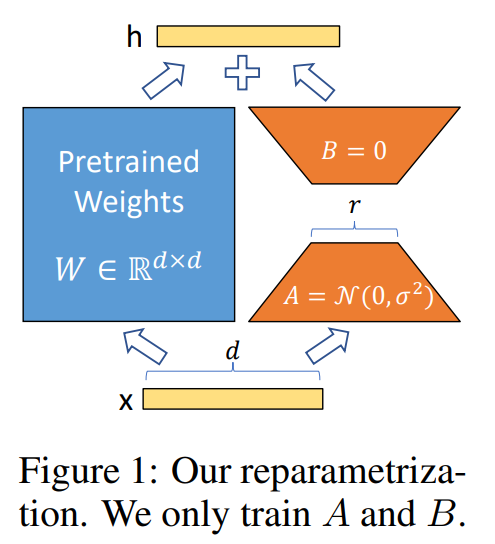

<style>
img[alt~="center"] {
  display: block;
  margin: 0 auto;
}
</style>

# Deploying AI 
## Finetuning

```code
$ echo "Data Sciences Institute"
```
---

# Introduction

---

# Agenda

---

## Agenda

+ Finetuning overview
+ Finetuning techniques


---

## Introduction to Finetuning

- Finetuning is the process of adapting a model to a specific task by adjusting its weights.
- Unlike prompt engineering or RAG, which guide models via inputs or external context, finetuning changes the underlying parameters.
- It can enhance domain-specific capabilities, improve safety, and strengthen instruction-following.
- Finetuning requires significant resources, including compute, data, and ML expertise.
- A memory-efficient approach called **parameter-efficient finetuning (PEFT)** has become dominant.

---

## Finetuning vs. Prompting

- Prompt-based methods adapt models by providing instructions, examples, or external information.
- Finetuning directly modifies the model’s weights to embed new behaviors.
- Prompting requires little ML knowledge, while finetuning requires training expertise.
- Prompting is usually the first step; finetuning is attempted when prompting is insufficient.

---

# Finetuning Overview

---

## Transfer Learning Foundations

- Finetuning is a form of **transfer learning**.
- Transfer learning means reusing knowledge from one task to accelerate learning on a related task.
- Foundation models exemplify transfer learning by transferring pre-training knowledge to specialized downstream tasks.
- For example, pretraining on text completion enables adaptation to legal QA, coding, or SQL tasks.

---

## Sample Efficiency

- Training from scratch requires massive data, often millions of examples.
- Finetuning leverages existing base model knowledge, reducing the amount of task-specific data needed.
- A few hundred high-quality examples can sometimes be sufficient.
- This efficiency is one of the key advantages of finetuning over training from scratch.

---

## Types of Finetuning

- **Continued pretraining (self-supervised finetuning):** extends pretraining with domain-specific raw data.
- **Supervised finetuning (SFT):** adapts models with instruction–response pairs.
- **Preference finetuning (RLHF/DPO):** aligns outputs with human preferences.
- **Infilling finetuning:** trains models to fill in blanks, useful for text editing and debugging.
- **Long-context finetuning:** extends maximum context length, often requiring architectural changes.

---

# When to Finetune

---

## Reasons to Finetune

- Finetuning can improve domain-specific performance when a base model is insufficient.
- It helps enforce strict output formats like JSON or YAML.
- It can mitigate harmful biases by training on carefully curated datasets.
- Smaller models can be finetuned to imitate larger ones, enabling efficiency gains through **distillation**.
- Finetuned small models can outperform larger unadapted models on specialized tasks.

---

## Examples of Finetuning Benefits

- Finetuning SQL models for less common dialects or custom queries.
- Grammarly finetuned Flan-T5 models with 82,000 examples, outperforming a GPT-3 variant despite being 60× smaller.
- Bias reduction studies show finetuning can improve fairness across gender and racial dimensions.
- Finetuned models often offer reduced latency and costs compared to larger general-purpose models.

---

## Reasons Not to Finetune

- Finetuning requires high up-front data, compute, and expertise.
- A finetuned model may improve at one task but degrade in others.
- High maintenance is required to keep up with newer, stronger base models.
- In many cases, well-crafted prompts and RAG can achieve sufficient results.
- Finetuning should not be the first step; systematic prompting should be tried first.

---

# Finetuning vs. RAG

---

## Finetuning vs. RAG: Failures

- **Information-based failures** should be addressed with RAG.
- **Behavioral failures** may require finetuning.
- RAG provides models with external, up-to-date, or private information.
- Finetuning improves adherence to formats, styles, and expected outputs.
- In short: **RAG is for facts, finetuning is for form**.

---

## Combining RAG and Finetuning

- Both methods can complement each other.
- Studies show RAG often outperforms finetuning for knowledge-heavy tasks.
- RAG on top of finetuned models can improve performance in some cases.
- However, sometimes RAG alone is more effective than combining with finetuning.
- Application developers must evaluate both approaches for their specific use case.

---

# Memory Bottlenecks

---

## Why Memory Matters

- Finetuning is far more memory-intensive than inference.
- Memory is consumed by weights, activations, gradients, and optimizer states.
- The number of trainable parameters determines the finetuning memory footprint.
- Techniques like **parameter-efficient finetuning (PEFT)** reduce memory costs.
- Quantization is another powerful way to lower memory needs.

---

## Memory Math

- Inference requires memory primarily for weights and activations.
- Training requires additional memory for gradients and optimizer states.
- Example: a 13B model in FP16 needs ~31 GB for inference.
- With full backpropagation and Adam optimizer, training can require over 100 GB.
- Gradient checkpointing can reduce memory at the cost of extra compute.

---

## Numerical Precision

- Models use floating-point or integer formats to represent values.
- FP32 (single precision) is memory-heavy; FP16 and BF16 are more efficient.
- INT8 and INT4 formats are emerging for even greater efficiency.
- Using the wrong precision format can significantly degrade model quality.
- Hardware support (GPU/TPU architecture) influences which formats are practical.

---

## Quantization

- Quantization reduces precision to shrink memory requirements.
- A 10B model in FP32 needs 40 GB; the same model in FP16 needs 20 GB.
- Post-training quantization (PTQ) is the most common approach.
- Serving models in 8-bit or 4-bit precision is increasingly common.
- Quantization can be applied to weights, activations, or both.

---

# Parameter-Efficient Finetuning (PEFT)

---

## Introduction to PEFT

- PEFT techniques reduce the number of trainable parameters.
- They make finetuning feasible on limited hardware.
- PEFT is widely adopted because it balances performance with efficiency.
- Examples include adapters, LoRA, and prefix tuning.
- These methods allow small changes while keeping most parameters frozen.

---

## Transfer Learning and Fine Tuning

+ In many applications, one cannot access large amounts of labelled text data to train a model.
+ Transfer learning allows to apply the information learned from one task to another.
+ ULMFit (Howard and Ruder, 2018) proposed the following process for transfer learning:

  - Body: (a) A network is trained on a general domain corpus. The weights of the body learn broad features of the source domain. (b) The full LM is fine-tuned on target task data using discriminative fine-tuning and slanted triangular learning rates (STLR).
  - Head: (c) A classifier trained for a specific task. The classifier is fine-tuned on the target task using gradual unfreezing, discriminative fine-tuning and STLR.

---

 


---

## LoRA: Low-Rank Adaptation


+ Fundamental observation: fine-tuning a dense layer only adds a low-rank weight matrix (delta-W) to the original weight matrix (W). 
+ Fine-tuning can be simplified to train the low-rank weight matrix delta-W, which has the same number of weights as the original weight matrix W.
+ The low-rank matrix delta-W can be expressed as the product of two low-rank matrices, A and B.
+ Instead of training the full *Body* and adding a *Head*, LoRA requires training a small delta-W with fewer parameters. 
+ Consequently, LoRA is faster to train and requires less memory.

---




---

## Adapter-Based Methods

- Adapters are small modules inserted into transformer layers.
- They enable training only a subset of parameters.
- Performance often approaches full finetuning with far less memory.
- Adapters can be stacked, shared, or tuned per task.
- They are one of the most popular PEFT techniques.

---

# Summary

---

## Key Takeaways

- Finetuning modifies model weights, unlike prompting or RAG.
- It enhances instruction-following, safety, and domain-specific performance.
- Finetuning is expensive and memory-intensive, requiring careful planning.
- RAG is often better for information needs, while finetuning is for format and behavior.
- Memory bottlenecks are mitigated with quantization, mixed precision, and PEFT.
- Parameter-efficient finetuning, especially adapter-based methods, has become the standard.


---


# References

---

## References

+ Howard, Jeremy, and Sebastian Ruder. "Universal language model fine-tuning for text classification." arXiv preprint arXiv:1801.06146 (2018). 
+ Hu, Edward J., et al. "Lora: Low-rank adaptation of large language models." arXiv preprint arXiv:2106.09685 (2021).bridging-the-gap-enhanced-neural-network-techniques-for-ai/).
+ Huyen, Chip. Designing machine learning systems. O'Reilly Media, Inc., 2022.
