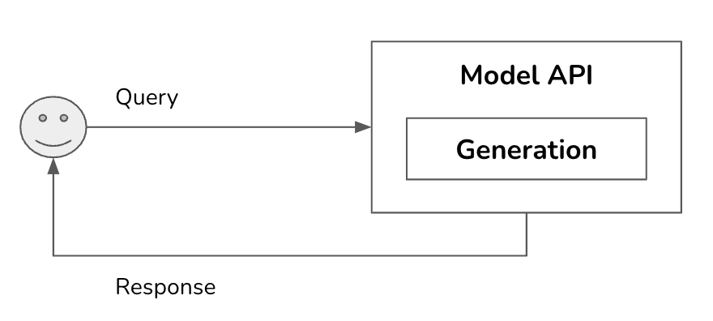
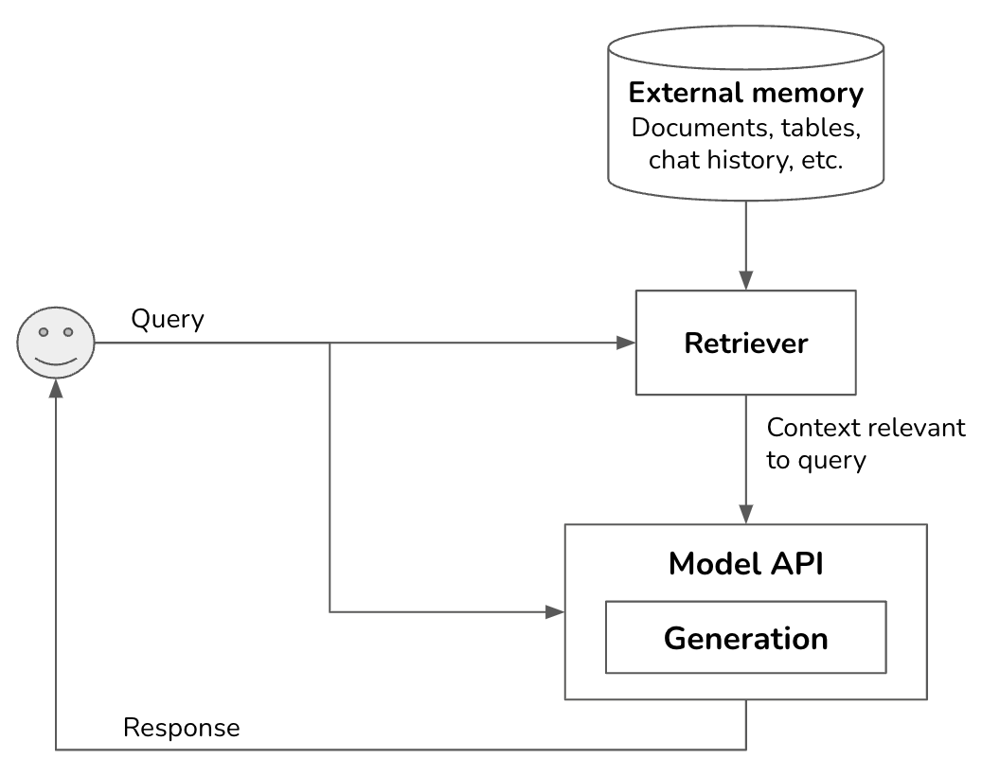
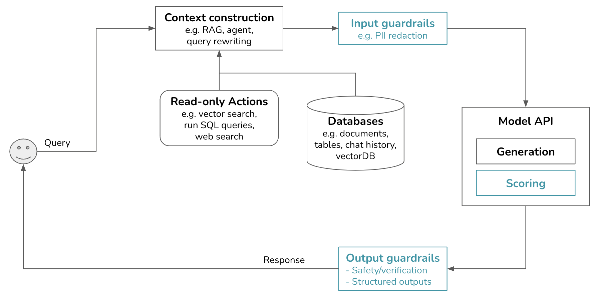
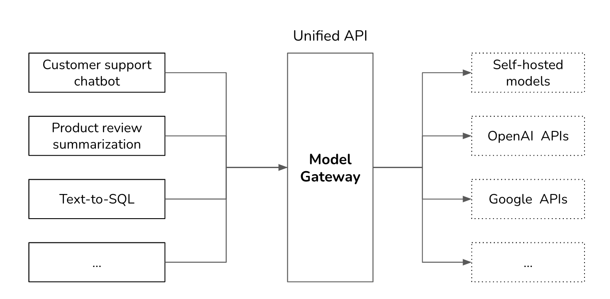
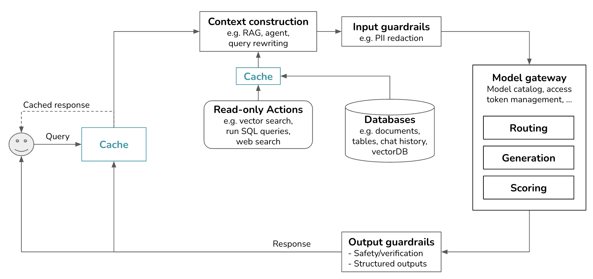

<style>
img[alt~="center"] {
  display: block;
  margin: 0 auto;
}
</style>

# Deploying AI 
## Optimization and System Design

```code
$ echo "Data Sciences Institute"
```
---

# Introduction

---

# Agenda

---

## Agenda

+ Inference optimization
+ AI engineering architecture
+ User feedback


---
## Software Products with Embedded AI

AI models have become generally available through general-purpose software:

+ Generate images, illustrations and video
+ Generate and rewrite text
+ Summarize documents and calls
+ Gather data
+ Review and Write Code

---

## Initial Stage: Interaction through LLMs Embedded in General Purpose Software

+ The simplest form of implementation is to acquire software with embedded AI (MS Copilot, ChatGPT, etc).
+ Simple mode of operation.
+ Low barriers to entry diminish the competitive advantage.
+ Guidelines and policies have limited effect over risk exposure.

---

## Initial Stage



---

## Challenges in Building Production-Level Applications with LLM (1/2)

Using LLMs:

+ It is easy to create a cool prototype, but difficult to create production-ready software.
+ LLM limitations are exacerbated:
  
  - Lack of engineering rigor in prompt engineering.
  - Natural language can be ambiguous.
  - It is a newly created field.

---

## Challenges in Building Production-Level Applications with LLM (2/2)

+ Ambiguity occurs in the way prompts are written (by human) and how they are interpreted (by LLM). For example:

  - Ambiguous output format: downstream applications expect outputs in a certain format, which LLMs do not necessarily provide consistently.
  - Inconsistency in user experience: LLMs are stochastic, there is no guarantee that the model will provide the same output given the same input every time.
  
---

## Areas of Enhancement


- Enhance context input into the model: give the model access to (external) data sources and tools for information gathering.
- Set up guardrails: protect systems and users.
- Add model router and gateway: support complex pipelines and security.
- Add cache: optimize for latency and cost.
- Add complex logic and write actions to maximize capabilities.

---

## Performance-Driven Development

Although FMs are a recent evolution in modelling, the principles of building AI enterprise applications remain the same:

- Map business metrics to AI metrics.
- Systematic experimentation.
- Experiment with different prompts (equivalent to hyperparameter tuning).
- Optimize for performance, latency, and cost.
- Set up feedback loops to iteratively improve our applications.

---

## Retrieval-Augmented Generation (RAG)

+ Similar to feature engineering in ML, RAG augments each query with necessary information.
+ Context construction:  gather the relevant information for the query.
+ The more context provided to the model, the less it needs to rely on its training.
+ In-context learning is a form of continual learning. It delays a model from being outdated by continually incorporating new information.

---




---

## Add Guardrails (1/3)

### Input guardrails

- The risk of exposing sensitive or private data to external vendors via external model APIs arises.
- Some guardrails include obfuscating personal information (ID numbers, phone, bank accounts, etc.), human faces, specific labels, keywords, and phrases that identify sensitive information.
  
---

## Add Guardrails (2/3)

###  Model jailbreaking:

- Preclude the model from executing queries that can be harmful.
- Ex.: no SQL queries. 

---

## Add Guardrails (3/3)

### Output guardrails

- Evaluate the quality of each generation, including empty responses, malformatted responses, toxic responses, factual inconsistent responses, responses that contain sensitive information, and brand-risk responses.
- Specify the policy to deal with different failure modes.


---



---

## Add Model Router and Gateway

+ A model router selects the best suitable model for the job:

  - An intent classifier predicts what the user is trying to do.
  - The right model is chosen for the task based on the predicted intent.
  
+ An intent classifier can also preclude out-of-scope conversations.
+ A model gateway allows the system to interface with different models in a unified and secure manner.

---



---

## Caching

+ Caching can significantly reduce latency and cost.
+ Prompt cache:

  - Store overlapping segments for reuse.
  - Application with long system prompts or that involve long documents.

+ Exact cache:

  - Cache stores processed items for reuse later.
  - Can be used to reduce vector search in embedding-based retrieval.
  
+ Semantic cache:

  - Determines semantic similarity between queries.

---



---


# References

---

## References

- Huyen, Chip. Designing machine learning systems. O'Reilly Media, Inc., 2022 
